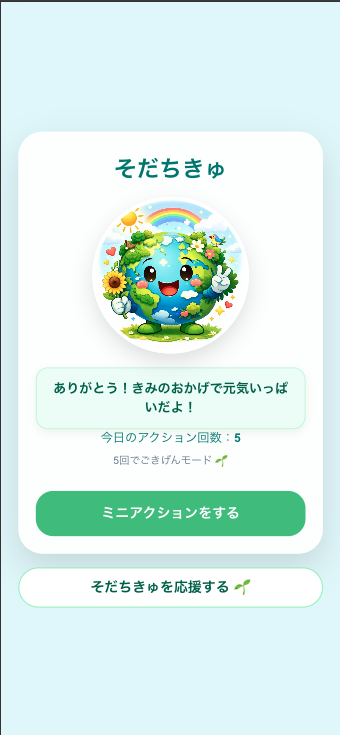
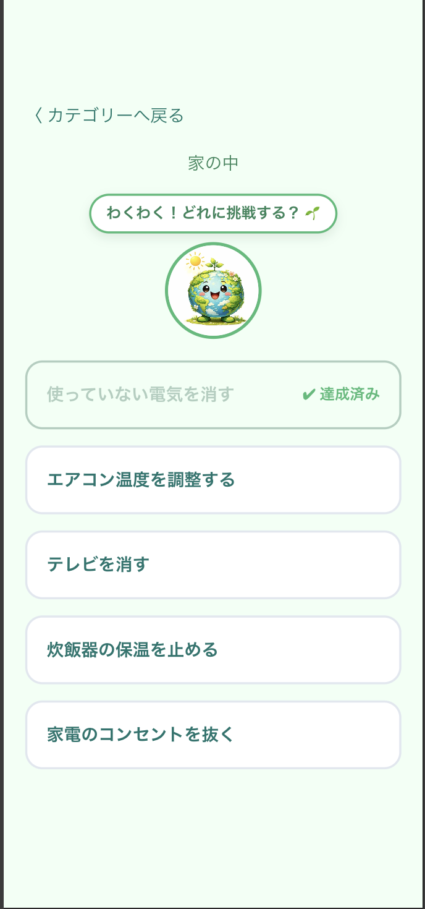

# そだちきゅ

## 概要

本プロジェクトは、環境問題に関心はあるものの
「何をすればよいか分からない」「行動が続かない」
と感じているユーザーに向けて、日常の中で実行できる小さな環境行動（ミニアクション）を提示するWebアプリです。

ユーザーが行動を記録すると地球キャラクターの状態が変化し、
行動の積み重ねを直感的に感じられる設計になっています。

数値評価や他者との比較ではなく、
「行動できたこと自体を肯定する体験」を重視しています。

## 目的

環境問題への関心は社会全体で高まっている一方で、
「関心はあるが具体的な行動に移せていない人」は依然として多く存在します。

その背景には、環境行動が
「正しい選択」「成果」「数値評価」
といった基準で語られることが多く、
行動のハードルを高めてしまう構造があります。

そこで本アプリでは、

- 行動の正しさや成果ではなく「行動したこと」を肯定する
- 小さな行動を日常の中に自然に取り入れられる

という体験設計を目指しました。

## 想定ユーザー

- 環境問題に関心はあるが、積極的な活動はしていない人
- 評価・他者との比較・成果指標に疲れている層

## 主な機能

- Firebase Authenticationによるログイン機能
- カテゴリ別ミニアクション一覧表示
- ミニアクション実行記録（1日1回制御）
- 行動数に応じた地球キャラクター状態の変化
- OpenAI APIを用いたAIメッセージ生成
- Stripeによる支援金決済機能
- 当日実行済みアクションの判定
- 日付変更による自動リセット（JST基準）

## 技術スタック

### Frontend

- TypeScript
- Next.js
- Tailwind CSS

### Backend

- Python
- FastAPI
- SQLAlchemy
- Pydantic

### Authentication / Authorization

- Firebase Authentication
- Firebase Admin SDK

### Database

- PostgreSQL

### Infrastructure

- Docker

### Payment

- Stripe

### AI

- OpenAI API

### Testing / Tools

- Pytest
- ESLint
- Prettier
- Ruff
- GitHub Actions
- Alembic

## システム構成

```
User
↓
Next.js (Frontend)
↓
Firebase Authentication
↓
FastAPI (Backend API)
↓
PostgreSQL

External Services
├ OpenAI API（AIメッセージ生成）
└ Stripe API（決済処理）
```

## アプリ画面

### ホーム画面

<p align="center">
  
</p>

### アクション実行画面

<p align="center">
  
</p>
